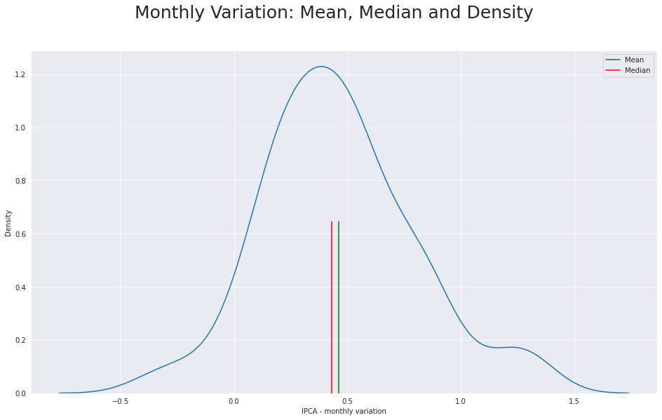
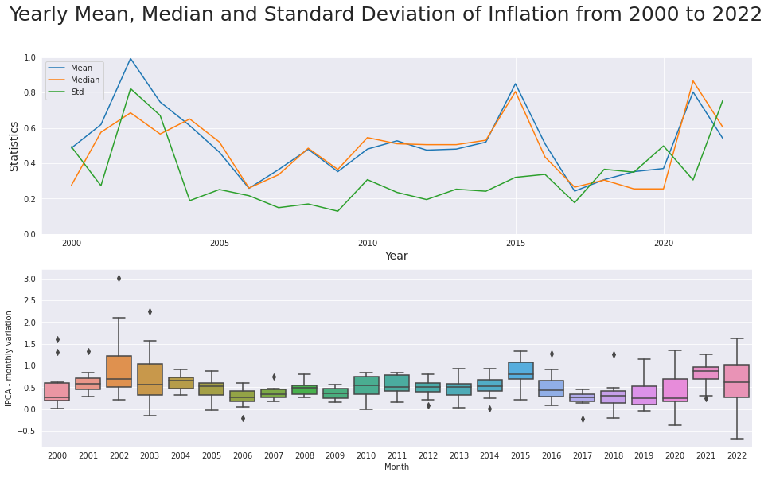

# IBGE Inflation Analysis in Brazil, Years 2000-2022

In this project I will analyse data gathered from IBGE in order to present an interesting figure relating to the economic behavior of inflation in Brazil. 

In the graph presented below, which takes into account the montlhy variation in the IPCA index from 2011 to 2020, we can see a slight positive skew, indicating that the outliers of the distribution tend towards the right of the graph, pointing to a regular but otherwise small growth in inflation, with some monthly indexes on the higher numbers. 

The following graph displays the yearly variation in Mean, Median and Standard Deviation, considering the year-long accumulated inflation periods of each year from 2000 to 2022.

Considering the Monthly Variation: Mean, Median and Density figure presented above, we can see the clear relation between the positive skew and the "high" and "low" outliers on the candlesticks nearing the final periods (especially 2022). 

Furthermore, the overall changing periods between high and low Means coupled with a similar pattern in the Medians further point to the observation made priorly that inflation grows regularly, albeit with periods of high inflation. 

The year with the highest mean monthly variation in IPCA is, by far, 2022, with a 0.99, with the second highest being 2015 (0.85) and the third highest being 2021 (0.80). All of these periods are correlated with political changes/crisis or, in the case of 2021, to the Covid pandemic. It is not easy, nor commandable, to extrapolate any greater theory from the data presented here, and such a work would demand a much more profound analysis of the data. However, it can be said that inflation in Brazil seems to be quite regular at any given period, with periods of greater turmoil than average which are related to easily identifiable historical moments. 
